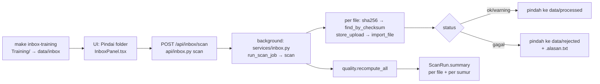
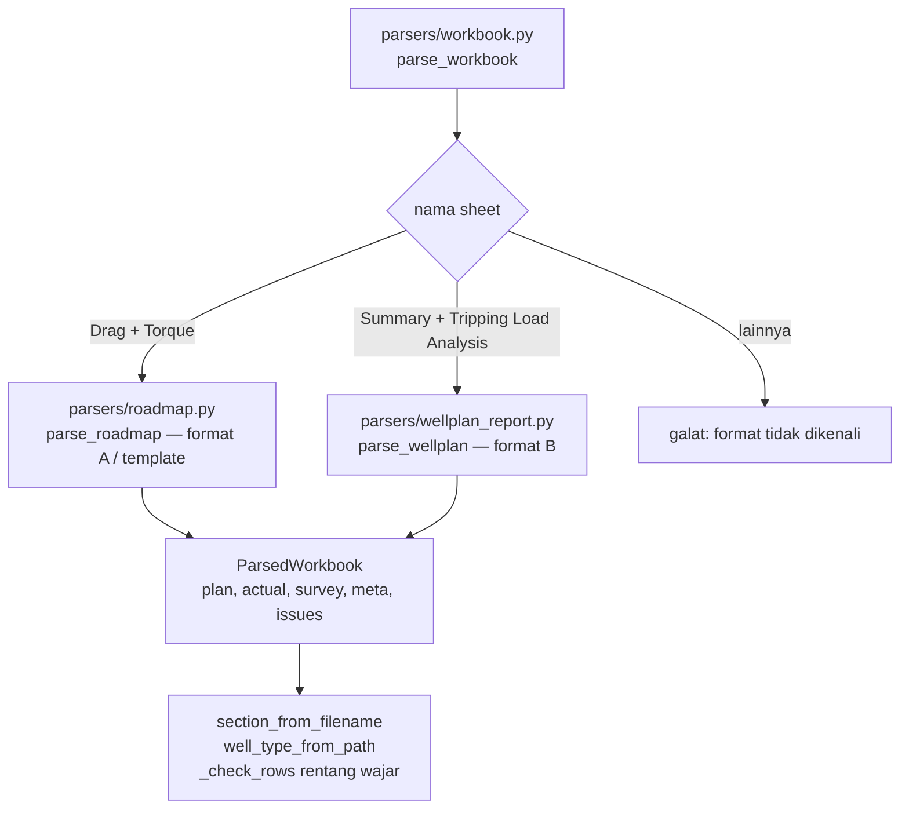
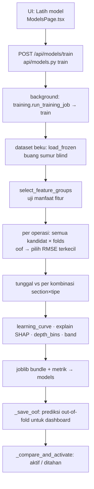
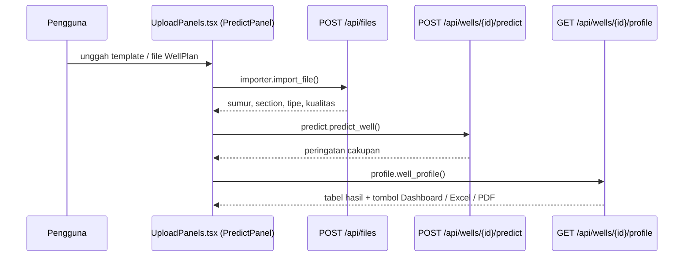
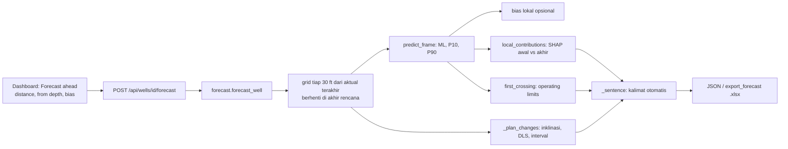

# Alur Sistem dan Peta Kode — Kalibrasi Torque & Drag ML

Dokumen berbagi pengetahuan untuk client dan developer: **setiap alur** (impor, kualitas data,
pelatihan, prediksi, dashboard, ekspor) dijelaskan dari **tombol di layar → endpoint API →
fungsi Python → tabel database → keluaran**, lengkap dengan **file dan folder** tempat kodenya.

Format rujukan kode: `folder/file.py` → `nama_fungsi()`. Semua jalur relatif dari root repo.

Dokumen terkait: `README.md` (setup), `docs/panduan.md` (panduan pengguna),
`docs/keputusan.md` (alasan setiap keputusan, kode K-xx).

---

## Daftar isi

1. [Gambaran arsitektur](#1-gambaran-arsitektur)
2. [Struktur folder](#2-struktur-folder)
3. [Model data (tabel database)](#3-model-data-tabel-database)
4. [Alur 1 — Login dan sesi](#4-alur-1--login-dan-sesi)
5. [Alur 2 — Impor massal dari folder](#5-alur-2--impor-massal-dari-folder)
6. [Alur 3 — Unggah file / template](#6-alur-3--unggah-file--template)
7. [Alur 4 — Parsing file Excel (format A, B, template)](#7-alur-4--parsing-file-excel-format-a-b-template)
8. [Alur 5 — Impor ke database](#8-alur-5--impor-ke-database)
9. [Alur 6 — Gerbang kualitas data](#9-alur-6--gerbang-kualitas-data)
10. [Alur 7 — Dataset, versi, blind test](#10-alur-7--dataset-versi-blind-test)
11. [Alur 8 — Pelatihan model](#11-alur-8--pelatihan-model)
12. [Alur 9 — Blind test](#12-alur-9--blind-test)
13. [Alur 10 — Prediksi sumur baru](#13-alur-10--prediksi-sumur-baru)
14. [Alur 11 — Dashboard tiga profil](#14-alur-11--dashboard-tiga-profil)
15. [Alur 12 — Batas aman](#15-alur-12--batas-aman)
16. [Alur 13 — Evaluasi prediksi vs aktual](#16-alur-13--evaluasi-prediksi-vs-aktual)
17. [Alur 14 — Ekspor Excel, PDF, template, laporan](#17-alur-14--ekspor-excel-pdf-template-laporan)
18. [Skrip pendukung](#18-skrip-pendukung)
19. [Daftar lengkap endpoint API](#19-daftar-lengkap-endpoint-api)
20. [Frontend (web)](#20-frontend-web)
21. [Konfigurasi, deploy, migrasi](#21-konfigurasi-deploy-migrasi)
22. [Tes](#22-tes)
23. [Cara mengembangkan (resep)](#23-cara-mengembangkan-resep)
24. [Glosarium](#24-glosarium)
25. [Perubahan feedback client #1: Training/Monitoring, Calibrate DD, forecast N ft, bahasa Inggris](#25-perubahan-feedback-client-1)

---

## 1. Gambaran arsitektur

```
Browser (React + Plotly)                      web/src/
      │  HTTPS (nginx di host, deploy/nginx/td-ml.conf)
      ▼
FastAPI  backend/app/main.py  ──► router  backend/app/api/*.py
      │                               │
      │                               ▼
      │                        layanan  backend/app/services/*.py
      │                               │        │
      │                     parser Excel        ML (scikit-learn, XGBoost, SHAP)
      │                  backend/app/parsers/   backend/app/services/training.py
      ▼                               │
PostgreSQL 16 (Docker volume pgdata)  ◄┘   ORM: backend/app/db/models.py
Folder data: data/inbox → data/processed | data/rejected   (bind mount)
Volume: uploads (salinan file), models (model .joblib + dataset beku .csv.gz)
```

| Lapisan | Folder | Tanggung jawab |
|---|---|---|
| Web | `web/src/` | Halaman, grafik Plotly, panggilan API (`web/src/api.ts`) |
| API | `backend/app/api/` | Validasi request, otorisasi, memanggil layanan, membentuk respons JSON/file |
| Layanan | `backend/app/services/` | Logika bisnis: impor, kualitas, dataset, training, prediksi, ekspor |
| Parser | `backend/app/parsers/` | Membaca Excel (tanpa menjalankan macro) menjadi data baku |
| Database | `backend/app/db/` | Model tabel SQLAlchemy dan sesi |
| Inti | `backend/app/core/` | Konfigurasi (`.env`), keamanan (hash password, sesi), logging |

Semua satuan disimpan dua kali: **nilai + satuan asli** dan **nilai SI** (`value_si`: m, kN, kN·m).
Konversi hanya di `backend/app/services/units.py`.

---

## 2. Struktur folder

```
.
├── backend/
│   ├── app/
│   │   ├── main.py                 # membuat app FastAPI, middleware sesi, daftar router, SPA
│   │   ├── cli.py                  # set-admin-password, refresh-meta, recompute-quality
│   │   ├── api/                    # router HTTP (satu file per area)
│   │   │   ├── auth.py  health.py  files.py  inbox.py  wells.py  quality.py
│   │   │   ├── datasets.py  models.py  limits.py  evaluations.py  templates.py
│   │   ├── core/                   # config.py  security.py  logging.py
│   │   ├── db/                     # models.py (tabel)  session.py (get_db)
│   │   ├── parsers/                # pembaca Excel
│   │   │   ├── workbook.py         # pintu masuk: deteksi format + section/tipe dari nama
│   │   │   ├── roadmap.py          # format A (+ Calibrate DD, template Well Info/Survey)
│   │   │   ├── wellplan_report.py  # format B
│   │   │   ├── common.py           # struktur hasil parse + helper angka/teks
│   │   │   └── column_map.py       # SEMUA pola nama sheet/kolom (ubah di sini bila ada varian)
│   │   └── services/               # logika bisnis
│   │       ├── importer.py   inbox.py   classify.py   units.py   operations.py
│   │       ├── quality.py    dataset.py training.py   predict.py metrics.py
│   │       ├── profile.py    limits.py  evaluation.py export.py  pdf.py  templates.py
│   │       ├── calibration.py (offset Calibrate DD)   forecast.py (forecast N ft + sebab-akibat)
│   ├── alembic/versions/           # 0001 skema awal, 0002 paket 6 minggu, 0003 purpose, 0004 kode status Inggris
│   ├── tests/                      # pytest + fixtures sintetis
│   └── requirements*.txt
├── web/src/                        # React + TypeScript + Vite
│   ├── api.ts  App.tsx  main.tsx  styles.css
│   ├── pages/                      # LoginPage, WellsPage, QualityPage, ModelsPage, DashboardPage, EvaluationsPage
│   └── components/                 # UploadPanels, InboxPanel, ThreeProfileChart, ForecastPanel, PlotlyChart, LimitsPanel, ...
├── scripts/                        # audit_files.py  anonymize_files.py  make_sample_data.py
├── deploy/                         # nginx/*.conf  setup_server.sh
├── docs/                           # panduan.md  keputusan.md  ALUR_DAN_KODE.md (ini)  utang_teknis.md
├── data/                           # TIDAK di Git: inbox/ processed/ rejected/ audit/ reports/
├── Training/                       # TIDAK di Git: data sumur client asli
├── Dockerfile  docker-compose.yml  Makefile  .env.example
```

---

## 3. Model data (tabel database)

File: `backend/app/db/models.py`. Migrasi: `backend/alembic/versions/`.

| Tabel (class) | Isi | Diisi oleh |
|---|---|---|
| `admin_user` (`AdminUser`) | satu akun admin, password hash argon2 | `main.py` → `ensure_admin()`, `cli.py` |
| `login_attempts` (`LoginAttempt`) | riwayat login untuk penguncian | `api/auth.py` → `login()` |
| `wells` (`Well`) | **satu baris = satu sumur × section × purpose** (`training`/`monitoring`); nama, section, tipe, `meta` (block weight, shoe, format, offset Calibrate DD, …) | `services/importer.py` |
| `uploaded_files` (`UploadedFile`) | file terimpor: checksum, `purpose`, status (`processing/ok/warning/failed/replaced/deleted`), versi, sumber (upload/folder/promote) | `services/importer.py` |
| `validation_issues` (`ValidationIssue`) | galat/peringatan per file | `services/importer.py` → `_save_issues()` |
| `survey` (`Survey`) | MD, inklinasi, azimuth, DLS (SI) | `importer._save_data()` |
| `plan_results` (`PlanResult`) | rencana WellPlan: operasi, FF, kedalaman, nilai | `importer._save_data()` |
| `actual_readings` (`ActualReading`) | pembacaan aktual | `importer._save_data()` |
| `well_quality` (`WellQuality`) | status A/B/C, skor, daftar pemeriksaan | `services/quality.py` → `evaluate_well()` |
| `quality_reviews` (`QualityReview`) | keputusan tinjauan (`accept`/`exclude`/`fix`) | `api/quality.py` → `review()` |
| `blind_sets` (`BlindSet`) | sumur blind test terkunci | `services/dataset.py` → `ensure_blind_set()` |
| `datasets` (`Dataset`) | versi dataset beku: daftar sumur, hash, jalur snapshot | `dataset.freeze_dataset()` |
| `models` (`MLModel`) | model terlatih: metrik, parameter, versi dataset, status, hasil blind test | `services/training.py` |
| `predictions` / `prediction_points` | prediksi per sumur (`kind`: `oof` atau `full`) dan titik per kedalaman | `training._save_oof()`, `predict.predict_well()` |
| `prediction_evaluations` | prediksi lama vs aktual yang datang belakangan | `services/evaluation.py` |
| `limits` (`Limit`) | batas aman per sumur atau per section | `api/limits.py` |
| `scan_runs` (`ScanRun`) | riwayat pindai folder + ringkasan hasil | `services/inbox.py` |

Operasi (target) didefinisikan di `backend/app/services/operations.py`:
`pick_up`, `slack_off`, `rotating_weight`, `torque_off_bottom`, `torque_on_bottom`.

---

## 4. Alur 1 — Login dan sesi

| Langkah | Kode |
|---|---|
| Halaman login, tombol mata password | `web/src/pages/LoginPage.tsx` |
| Cek sesi saat aplikasi dibuka | `web/src/App.tsx` → `GET /api/auth/me` |
| `POST /api/auth/login` | `backend/app/api/auth.py` → `login()` → `_is_locked()` (5 gagal/15 menit) → `core/security.py` → `verify_password()` |
| Cookie sesi bertanda tangan (8 jam, HttpOnly, SameSite=Lax) | `backend/app/main.py` → `create_app()` (`SessionMiddleware`) |
| Semua `/api/*` wajib login (kecuali health & login) | `main.py` → `dependencies=[Depends(require_admin)]`; `core/security.py` → `require_admin()` |
| Akun dibuat dari `.env` saat start pertama | `main.py` → `ensure_admin()` |
| Ganti password | `backend/app/cli.py` → `set_admin_password()` (`make password`) |
| Tes | `backend/tests/test_auth.py` |

---

## 5. Alur 2 — Impor massal dari folder



| Langkah | File | Fungsi |
|---|---|---|
| Salin data client ke inbox | `Makefile` | target `inbox-training` |
| Panel status + tombol | `web/src/components/InboxPanel.tsx` | `InboxPanel()` |
| Status inbox (jumlah file, folder) | `backend/app/api/inbox.py` → `status()` | `services/inbox.py` → `inbox_status()`, `pending_files()` |
| Mulai pindai (background task) | `api/inbox.py` → `scan()` | `services/inbox.py` → `run_scan_job()` → `scan()` |
| Lewati file baru diubah < 60 dtk, batas ukuran | `services/inbox.py` | `scan()` (setting `INBOX_MIN_AGE_S`, `MAX_UPLOAD_MB`) |
| Idempoten (checksum) | `services/importer.py` | `sha256()`, `find_by_checksum()` |
| Impor satu file | `services/importer.py` | `store_upload()`, `import_file()` → [Alur 5](#8-alur-5--impor-ke-database) |
| Pindah file + alasan | `services/inbox.py` | `_move()` |
| Hitung ulang kualitas semua sumur | `services/quality.py` | `recompute_all()` |
| Riwayat & detail hasil | `api/inbox.py` | `runs()`, `run_detail()` |
| Konfigurasi folder | `backend/app/core/config.py` | `inbox_dir`, `processed_dir`, `rejected_dir`, `inbox_move` |
| Mount folder ke container | `docker-compose.yml` | `./data/inbox:/data/inbox` dst. |

Aturan nama: `data/inbox/<J|S|Horizontal>/<nama sumur>/<file>`. Nama folder = kode sumur
(`parsers/workbook.py` → `well_folder_from_path()`), folder induk = tipe (`well_type_from_path()`).

---

## 6. Alur 3 — Unggah file / template

| Langkah | File | Fungsi |
|---|---|---|
| Panel **Upload training data** (5 langkah) | `web/src/components/UploadPanels.tsx` | `TrainingUploadPanel()` |
| Panel **Upload a monitoring well** (5 langkah, lalu prediksi) | `web/src/components/UploadPanels.tsx` | `MonitoringUploadPanel()` |
| Langkah 1 wajib: Well section + Well type (+ nama opsional); dropzone nonaktif sebelum dipilih | `UploadPanels.tsx` | `WellChoiceFields()`, `useDrop(…, disabled)` |
| Catatan file asli WellPlan | `UploadPanels.tsx` | `RawFileNote()` |
| Unduh template | `backend/app/api/templates.py` → `template()` | `services/templates.py` → `build_template("training" \| "monitoring")` (alias lama `data-latih`/`sumur-baru`) |
| `POST /api/files` (multipart: file, **purpose**, **section_in**, **well_type** wajib; well_name opsional) | `backend/app/api/files.py` → `upload()` | validasi purpose/section/tipe, cek ekstensi, ukuran, tanda ZIP → `importer.store_upload()` → `importer.import_file(…, purpose=)` |
| Respons (status impor, sumur, section, tipe, kualitas) | `api/files.py` | `file_out()` |
| Riwayat impor | `api/files.py` | `list_files()`, `get_file()`, `download()` |

---

## 7. Alur 4 — Parsing file Excel (format A, B, template)



**Pintu masuk:** `backend/app/parsers/workbook.py` → `parse_workbook(path, filename, rel_path)`.
File dibuka dengan `parsers/common.py` → `open_workbook()` (`read_only`, `data_only`, `keep_vba=False`
— **macro tidak pernah dijalankan**).

Hasil parse: `parsers/common.py` → `ParsedWorkbook` (field `fmt`, `plan: list[Row]`,
`actual: list[Row]`, `survey: list[SurveyRow]`, `meta: dict`, `issues: list[Issue]`).

### Format A — roadmap `.xlsx` (dan template)
File: `backend/app/parsers/roadmap.py`

| Sheet | Fungsi | Isi yang diambil |
|---|---|---|
| `Drag` | `_parse_block_sheet()` + `_parse_drag_calibration()` | blok per FF: `Tripping Out`→pick up, `Tripping In`→slack off, `Rotating Off Bottom`→rotating weight; blok "Graph reference" diabaikan |
| `Torque` | `_parse_block_sheet()` + `_parse_torque_calibration()` | `Rotating On Bottom`→torque on bottom, `Rotating Off Bottom`→torque off bottom |
| `T&D Actual Reading` | `_parse_actual()` | depth, pick up, slack off, rotating, torsi; meta Well/Block Weight/Section/Run |
| `Info Sumur` (template) | `_parse_info()` | nama, section, tipe, block weight, casing shoe, mud weight |
| `Survey` (template) | `wellplan_report._parse_survey()` | MD, inklinasi, azimuth, DLS |
| `Casing Shoe`, `Petunjuk`, `Contoh …` | — | diabaikan |
| Nilai FF dari teks | `_ff()` | `"open hole friction factor: 0.30"` → 0.3 |

### Format B — laporan WellPlan `.xlsm`
File: `backend/app/parsers/wellplan_report.py`

| Sheet | Fungsi | Isi yang diambil |
|---|---|---|
| `Summary` | `_parse_summary()`, `_parse_bha()`, `_parse_wellbore()`, `_parse_ff_table()` | Well, Field, Block Weight, Mud Weight, BHA (panjang/berat), casing shoe, diameter lubang, Base FF |
| `Tripping Load Analysis` | `_parse_tripping()` | `CSG x OPH y Trip IN/Out` per FF, `Rotate Off Bottom` |
| `Off Bottom Torque analysis` | `_parse_offbottom()` | torque off bottom per FF |
| `Rotary Drill Buckling Outputs` | `_parse_rotary()` | `Surface Torque` = rencana torque on bottom (Base FF) |
| `Survey Outputs` | `_parse_survey()` | MD, Inclination, Azimuth, Dog-Leg Severity |
| `Drilling Data` | `_parse_drilling()` | aktual: SO, ROT, PU (klbf), torsi (kft-lbf diasumsikan bila < 100) |
| `Tripping  Data` | `_parse_tripdata()` | aktual trip #1–#3 (pengganti) |
| Tabel berkepala "Bit Depth" | `_bitdepth_table()`, `_collect()` | helper |

### Helper bersama
| Kebutuhan | Fungsi (file) |
|---|---|
| Angka dari sel (termasuk teks `'141'`, desimal koma) | `to_float()` (`parsers/common.py`) |
| Angka pertama dari teks (`'21 (1000 lbf)'`, `'8-1/2"'`) | `first_number()` |
| Satuan dari teks (`'(Klbs)'`, `'1000 ft.lbf'`) | `unit_in()` → `services/units.py` → `unit_from_header()`, `normalize_unit()` |
| Pola nama sheet/kolom | `parsers/column_map.py` (konstanta) |
| Section dari nama file (`_8.5in`, `12.25 HS`, `22inHS`) | `workbook.section_from_filename()` |
| Buang nilai di luar rentang fisik | `workbook._check_rows()` |

---

## 8. Alur 5 — Impor ke database

File: `backend/app/services/importer.py` → `import_file(db, path, original_name, checksum,
well_name, section_in, rel_path, source, well_type)`

| Urutan | Fungsi | Penjelasan |
|---|---|---|
| 1 | `find_by_checksum()` | file identik sudah ada → kembalikan yang lama (tidak dobel) |
| 2 | `parse_workbook()` | lihat [Alur 4](#7-alur-4--parsing-file-excel-format-a-b-template) |
| 3 | nama sumur | form > folder > `Info Sumur`/`Well:` > awalan nama file (`_name_from_filename()`) |
| 4 | section | form > template > nama file > diameter (B) > sheet aktual → `services/classify.py` → `classify_section()` |
| 5 | `_get_or_create_well()` | baris `wells` per (nama, section) |
| 6 | `_replace_previous()` | file baru untuk sumur-section sama → file lama "diganti", versi naik |
| 7 | `_save_data()` | simpan survey, plan, actual (nilai asli + SI), `well.meta` |
| 8 | `_classify()` | tipe: form > template > folder > survey (`classify.classify_well_type()`) |
| 9 | `_save_issues()`, `_summary()` | galat/peringatan dan ringkasan file |
| 10 | `quality.evaluate_well()` | status kualitas sumur ini |
| 11 | `evaluation.evaluate_well_predictions()` | bila ada data aktual baru → evaluasi prediksi lama |

---

## 9. Alur 6 — Gerbang kualitas data

File: `backend/app/services/quality.py`. Halaman: `web/src/pages/QualityPage.tsx`.

| Langkah | Fungsi |
|---|---|
| Muat data sumur | `_load()` |
| Kurva WellPlan baseline (FF 0,3) | `_baseline_curve()` |
| Statistik sumur (titik dalam rentang, rasio aktual/WellPlan) | `well_stats()` |
| **Pemeriksaan** K1–K9 (kritis) dan S1–S5 (peringatan) → status A/B/C + skor | `evaluate_well()` |
| Banding sesama kelas (section × tipe, MAD) | `_peer_checks()` |
| Deteksi duplikat sumur | `_duplicate_of()` |
| Hitung ulang semua sumur (dua lintasan) | `recompute_all()` |
| Tinjauan terakhir & status efektif (A/B/C/X) | `latest_review()`, `effective_status()` |
| Sumur yang boleh masuk training | `eligible_well_ids()` |

| Kode | Pemeriksaan | Tingkat |
|---|---|---|
| K1 | rencana operasi inti (pick up, slack off) ada | kritis |
| K2 | satuan wajar (rasio hookload 0,33–3; torsi bukan faktor ~1000) | kritis |
| K3 | kedalaman: duplikat bertentangan (kritis) / urutan turun (peringatan) | kritis/peringatan |
| K4 | nilai fisik (hookload > 0, torsi ≥ 0) | kritis bila > 10% |
| K5 | urutan slack off ≤ rotating ≤ pick up | kritis bila > 25% |
| K6 | ≥ 8 titik aktual pick up dalam rentang WellPlan | kritis |
| K8 | section & tipe diketahui | kritis |
| K9 | bukan duplikat sumur lain | kritis |
| S1–S5 | rasio menyimpang dari sekelas, lompatan, nilai berulang, titik sedikit, rasio torsi | peringatan |

API (`backend/app/api/quality.py`): `list_quality()`, `recompute()`, `review()`, `report()`
(Excel via `services/export.py` → `export_quality_report()`).

---

## 10. Alur 7 — Dataset, versi, blind test

File: `backend/app/services/dataset.py`. UI: `web/src/pages/ModelsPage.tsx` → `DatasetPanel()`.

| Langkah | Fungsi | Penjelasan |
|---|---|---|
| Info sumur + meta | `load_wells()` | section, tipe, format, shoe, block weight, mud, BHA |
| Rencana / aktual / survey | `load_plan()`, `load_actual()`, `load_survey()` | aktual non-fisik dibuang; Tripping Data hanya pengganti |
| Kurva per FF | `plan_curves()` | `{ff: (kedalaman, nilai)}` |
| WellPlan di kedalaman aktual (FF 0,3 & 0,5) | `wp_at()`, `_interp()` | tanpa ekstrapolasi |
| Fitur survey (inklinasi, DLS, tortuosity, KOP, tipe interval) | `survey_features()` | |
| Satu frame fitur | `features_frame()` | dipakai training **dan** prediksi |
| Grup fitur | `FEATURE_GROUPS`, `feature_columns()` | dasar + survey, casing_shoe, bha_lumpur, kop_interval, block_weight |
| Dataset latih | `build_dataset()` + `_drop_outliers()` | 1 baris per (sumur, operasi, kedalaman aktual) |
| Grid kedalaman prediksi | `plan_grid()` | mulai dari casing shoe, rapat tiap ~100 ft |
| **Kunci blind test** (~20% sumur per tipe) | `ensure_blind_set()`, `active_blind_set()` | sekali, berlaku untuk versi berikutnya |
| **Bekukan dataset** | `freeze_dataset()` | snapshot CSV gz + SHA-256 + daftar sumur → tabel `datasets` |
| Muat snapshot (cek hash) | `load_frozen()` | dipakai training dan blind test |

API (`backend/app/api/datasets.py`): `list_datasets()`, `freeze()`, `blind()`, `reset_blind()`,
`get_dataset()`, `download()`.

---

## 11. Alur 8 — Pelatihan model



File: `backend/app/services/training.py`

| Bagian | Fungsi / class | Penjelasan |
|---|---|---|
| Daftar algoritma & setelan | `ALGO_GRID`, `candidates()` | Ridge, XGBoost, Random Forest, SVR, MLP (opsional) × target langsung/selisih |
| Pipeline sklearn | `_preprocess()`, `make_pipeline()` | imputasi median + indikator kosong, skala, one-hot |
| Model satu operasi | `CalibrationModel` (`fit()`, `predict()`) | target "selisih" = aktual − WellPlan FF 0,3 |
| Model tunggal + per kombinasi | `RoutedModel` | prediksi diarahkan ke model kombinasi bila dipilih |
| Fold per sumur | `folds()` (GroupKFold 5), `oof()` | satu sumur tidak pernah di latih & uji sekaligus |
| Uji manfaat fitur | `_score_groups()`, `select_feature_groups()` | grup dipakai bila skor turun ≥ 1% |
| Laporan per kelompok | `group_report()`, `depth_bins()`, `better_frac()` | per section/tipe/kedalaman/sumur |
| Kurva belajar | `learning_curve()` | 5, 10, 20, 30, semua sumur |
| SHAP / pentingnya fitur | `explain()`, `_base_feature()` | TreeExplainer / LinearExplainer / permutation importance |
| Skor ringkas | `skill()` | rata-rata RMSE ML / RMSE WellPlan |
| **Orkestrasi** | `train()` | menyimpan `models/model_<id>.joblib` + metrik |
| Prediksi out-of-fold untuk dashboard | `_save_oof()` | tabel `predictions` (`kind="oof"`) |
| Banding dengan model aktif | `_compare_and_activate()` | lebih buruk > 1% → status `ditahan` |
| Job latar belakang | `run_training_job()` | sesi DB sendiri, status `antri → berjalan → selesai/ditahan/gagal` |
| Model aktif | `active_model()` | |

Metrik: `backend/app/services/metrics.py` → `rmse()`, `mape()` (penyebut minimal 5% median),
`r2()`, `all_metrics()`.

API (`backend/app/api/models.py`): `train()`, `list_models()`, `get_model()`, `activate()`,
`blind_test()`, `report()` (xlsx), `report_pdf()`, `dataset_csv()`.

---

## 12. Alur 9 — Blind test

| Langkah | Kode |
|---|---|
| Tombol "Jalankan blind test" (konfirmasi) | `web/src/pages/ModelsPage.tsx` → `ModelDetail()` |
| `POST /api/models/{id}/blind-test` | `api/models.py` → `blind_test()` |
| Uji **sekali** pada sumur blind, simpan `models.blind_result` | `services/training.py` → `run_blind_test()` |
| Prediksi penuh untuk sumur blind (agar bisa dilihat setelah uji) | `services/predict.py` → `predict_well()` |

---

## 13. Alur 10 — Prediksi sumur baru



File: `backend/app/services/predict.py`

| Fungsi | Penjelasan |
|---|---|
| `load_bundle()` | memuat model `.joblib` (cache) |
| `coverage_warnings()` | section/tipe tidak ada atau jarang (< 3 sumur) di data latih |
| `predict_frame()` | prediksi + pita 10–90% satu operasi |
| `predict_well()` | grid kedalaman (`dataset.plan_grid()`), fitur (`dataset.features_frame()`), prediksi semua operasi → `predictions` (`kind="full"`) |
| `prediction_for_dashboard()` | sumur latih → `oof`; sumur lain → `full` |

API: `api/wells.py` → `predict()`.

---

## 14. Alur 11 — Dashboard tiga profil

| Bagian | File | Fungsi |
|---|---|---|
| Halaman + filter (data group, section, tipe, kualitas, sumur, satuan, model, kurva WellPlan calibrated/raw) | `web/src/pages/DashboardPage.tsx` | `DashboardPage()` |
| Tiga panel bertumpuk, zoom tersinkron, garis penuntun, band P10–P90 (putus-putus), batas (titik-titik), zona forecast | `web/src/components/ThreeProfileChart.tsx` | `ThreeProfileChart()`, `flaggedIntervals()` |
| Panel forecast N ft | `web/src/components/ForecastPanel.tsx` | `ForecastPanel()` |
| Pembungkus Plotly (overlay garis penuntun, event zoom) | `web/src/components/PlotlyChart.tsx` | `PlotlyChart()` |
| Warna (satu warna per OHFF) dan simbol | `web/src/components/chartTheme.ts` | `COLOR`, `OHFF_COLOR`, `ohffColor()`, `SYMBOL` |
| Panel batas aman | `web/src/components/LimitsPanel.tsx` | `LimitsPanel()` |
| `GET /api/wells/{id}/profile?units=&model_id=&calibration=` | `backend/app/api/wells.py` | `profile()` |
| Data profil: WellPlan per OHFF (nama seri baku, + offset Calibrate bila `calibrated`), ROT satu kurva, ML (+band), aktual, selisih, metrik, batas, kualitas | `backend/app/services/profile.py` | `well_profile()` |

Konvensi selisih: **A − B**, kanan (+) = A lebih tinggi. Persen memakai `profile._pct()`.

---

## 15. Alur 12 — Batas aman

| Bagian | Kode |
|---|---|
| Tambah/hapus batas (per sumur atau per section) | `web/src/components/LimitsPanel.tsx` → `POST/DELETE /api/limits` |
| API | `backend/app/api/limits.py` → `list_limits()`, `create()`, `remove()` |
| Batas yang berlaku (sumur menimpa section) | `backend/app/services/limits.py` → `applicable_limits()` |
| Kedalaman pertama menyentuh batas | `limits.first_crossing()` |
| Margin minimum | `limits.margin()` |
| Ditampilkan di dashboard, Excel ("Batas aman"), PDF | `profile.well_profile()`, `export.export_well()`, `pdf.well_pdf()` |

---

## 16. Alur 13 — Evaluasi prediksi vs aktual

| Langkah | Kode |
|---|---|
| Data aktual sumur yang pernah diprediksi diimpor | `importer.import_file()` memanggil → |
| Bandingkan prediksi tersimpan dengan aktual & WellPlan | `backend/app/services/evaluation.py` → `evaluate_well_predictions()` → `evaluate_prediction()` |
| Daftar hasil | `backend/app/api/evaluations.py` → `list_evaluations()`; UI `web/src/pages/EvaluationsPage.tsx` |
| Picu manual | `api/wells.py` → `evaluate()` |

---

## 17. Alur 14 — Ekspor Excel, PDF, template, laporan

| Keluaran | Endpoint | Fungsi |
|---|---|---|
| Excel per sumur (Info, Drag, Torque, T&D Actual Reading, Selisih, Grafik, Batas aman, Metrik) | `GET /api/wells/{id}/export.xlsx` | `services/export.py` → `export_well()` |
| PDF per sumur (2 halaman) | `GET /api/wells/{id}/report.pdf` | `services/pdf.py` → `well_pdf()`, `_three_charts()` |
| Laporan model Excel | `GET /api/models/{id}/report.xlsx` | `export.export_model_report()` |
| Ringkasan model PDF | `GET /api/models/{id}/report.pdf` | `pdf.model_pdf()` |
| Laporan kualitas data | `GET /api/quality/report.xlsx` | `export.export_quality_report()` |
| Template training / monitoring | `GET /api/templates/{training\|monitoring}.xlsx` | `services/templates.py` → `build_template()` (`_instructions`, `_info`, `_drag`, `_torque`, `_actual`, `_survey`, `_examples`) |
| Dataset beku | `GET /api/datasets/{id}/download.csv.gz` | `api/datasets.py` → `download()` |

Excel ditulis dengan XlsxWriter (tanpa macro). PDF: ReportLab + grafik matplotlib (font DejaVu).

---

## 18. Skrip pendukung

| Skrip | Fungsi utama | Perintah |
|---|---|---|
| `scripts/audit_files.py` | `audit_file()`, `write_report()` — format, sheet, satuan, titik, matriks, penyimpangan | `make audit` → `data/audit/` |
| `scripts/anonymize_files.py` | ganti nama sumur/lapangan/koordinat dengan kode; peta disimpan terpisah | `python scripts/anonymize_files.py <folder>` |
| `scripts/make_sample_data.py` | data **sintetis** format A & B (model soft-string): `build_well()`, `write_roadmap_file()`, `write_wellplan_file()` | `make inbox-sample` |

---

## 19. Daftar lengkap endpoint API

Semua kecuali `health` dan `auth/login` wajib login. `/docs` (Swagger) hanya aktif saat
`APP_ENV` ≠ `production`.

| Metode & jalur | File → fungsi |
|---|---|
| `GET /api/health` | `api/health.py` → `health()` |
| `POST /api/auth/login` · `POST /api/auth/logout` · `GET /api/auth/me` | `api/auth.py` → `login()`, `logout()`, `me()` |
| `GET /api/inbox/status` · `POST /api/inbox/scan` · `GET /api/inbox/runs` · `GET /api/inbox/runs/{id}` | `api/inbox.py` → `status()`, `scan()`, `runs()`, `run_detail()` |
| `POST /api/files` · `GET /api/files?purpose=` · `GET /api/files/{id}` · `GET /api/files/{id}/download` | `api/files.py` → `upload()`, `list_files()`, `get_file()`, `download()` |
| `GET /api/templates/{kind}.xlsx` | `api/templates.py` → `template()` |
| `GET /api/wells?purpose=` · `GET /api/wells/matrix` · `GET/PATCH/DELETE /api/wells/{id}` | `api/wells.py` → `list_wells()`, `matrix()`, `get_well()`, `patch_well()`, `delete_well()` |
| `POST /api/wells/{id}/predict` · `GET /api/wells/{id}/profile` · `POST /api/wells/{id}/promote` | `api/wells.py` → `predict()`, `profile()`, `promote()` |
| `POST /api/wells/{id}/forecast` · `POST /api/wells/{id}/forecast.xlsx` | `api/wells.py` → `forecast()`, `forecast_xlsx()` → `services/forecast.py` |
| `GET /api/wells/{id}/export.xlsx` · `GET /api/wells/{id}/report.pdf` · `POST /api/wells/{id}/evaluate` | `api/wells.py` → `export()`, `report_pdf()`, `evaluate()` |
| `GET /api/quality` · `POST /api/quality/recompute` · `POST /api/quality/{well_id}/review` · `GET /api/quality/report.xlsx` | `api/quality.py` → `list_quality()`, `recompute()`, `review()`, `report()` |
| `GET /api/datasets` · `POST /api/datasets/freeze` · `GET /api/datasets/blind` · `POST /api/datasets/blind/reset` · `GET /api/datasets/{id}` · `GET /api/datasets/{id}/download.csv.gz` | `api/datasets.py` → `list_datasets()`, `freeze()`, `blind()`, `reset_blind()`, `get_dataset()`, `download()` |
| `GET /api/models` · `POST /api/models/train` · `GET /api/models/dataset.csv` · `GET /api/models/{id}` | `api/models.py` → `list_models()`, `train()`, `dataset_csv()`, `get_model()` |
| `POST /api/models/{id}/activate` · `POST /api/models/{id}/blind-test` · `GET /api/models/{id}/report.xlsx` · `GET /api/models/{id}/report.pdf` | `api/models.py` → `activate()`, `blind_test()`, `report()`, `report_pdf()` |
| `GET /api/limits` · `POST /api/limits` · `DELETE /api/limits/{id}` | `api/limits.py` → `list_limits()`, `create()`, `remove()` |
| `GET /api/evaluations` | `api/evaluations.py` → `list_evaluations()` |

---

## 20. Frontend (web)

| File | Isi |
|---|---|
| `web/src/main.tsx` | bootstrap React, TanStack Query, router |
| `web/src/App.tsx` | cek login, menu (Training Data, Monitoring, Data Quality, Models, Dashboard, Evaluations, How-to Guide), rute (`/training`, `/monitoring`, `/quality`, `/models`, `/evaluations`, `/help`; rute lama diarahkan) |
| `web/src/api.ts` | `api.get/post/patch/del`, tipe data (`WellItem`, `Profile`, `ModelItem`, `QualityRow`, …), `OPS`, `fmt()` |
| `web/src/pages/LoginPage.tsx` | form login + tombol tampil/sembunyi password |
| `web/src/pages/WellsPage.tsx` | `WellsPage({purpose})`: training = `InboxPanel` + `TrainingUploadPanel`, monitoring = `MonitoringUploadPanel` (+ Promote to training); daftar sumur dengan filter & grouping (section, tipe, kualitas), matriks, riwayat impor |
| `web/src/pages/QualityPage.tsx` | status A/B/C/X, detail pemeriksaan, `ReviewForm` |
| `web/src/pages/ModelsPage.tsx` | `DatasetPanel`, form latih, riwayat model, `ModelDetail` (tab laporan, blind test, kurva belajar, SHAP) |
| `web/src/pages/DashboardPage.tsx` | filter, `ThreeProfileChart`, `ForecastPanel`, `LimitsPanel`, tabel 5 selisih terbesar, metrik; bawaan All OHFF curves ✓, band ✗ |
| `web/src/pages/EvaluationsPage.tsx` | evaluasi prediksi vs aktual |
| `web/src/pages/HelpPage.tsx` | menu **How-to Guide**: sub-menu per grup, pencarian, navigasi (`/help/:topic`) |
| `web/src/help/content.tsx` | **isi How-to Guide** (bahasa Inggris; `TOPICS`, `GROUPS`): What This System Does (teks client), Quick Start, langkah demi langkah, use case, alur sistem, keluaran, FAQ |
| `web/src/help/ui.tsx` | komponen panduan: `Steps`, `Step`, `Flow` (diagram alur), `Tip`, `Ui` (label tombol), `Go`, `Table` |
| `web/src/components/*.tsx` | komponen di atas + `QualityBadge` |
| `web/src/styles.css` | gaya (warna token di `:root`) |

Build: `npm run build` → `web/dist`; di dalam image Docker disalin ke `/app/static` dan disajikan oleh
FastAPI (`main.py` → rute `spa()`).

---

## 21. Konfigurasi, deploy, migrasi

| Topik | File |
|---|---|
| Variabel lingkungan (DB, SECRET_KEY, cookie, admin, folder inbox) | `.env.example` → `backend/app/core/config.py` (`Settings`) |
| Container | `Dockerfile` (build web + Python), `docker-compose.yml` (db, app, backup, bind mount `data/`) |
| Perintah | `Makefile` (`up`, `down`, `logs`, `password`, `inbox-training`, `inbox-sample`, `audit`, `test`, `lint`, `backup`) |
| Migrasi skema | `backend/alembic/versions/0001_skema_awal.py`, `0002_paket_6_minggu.py` (jalan otomatis saat container start) |
| Server | `deploy/setup_server.sh`, `deploy/nginx/td-ml.conf` (template domain umum) |
| Subdomain dev | `deploy/nginx/dev-ml-kalibrasi-torque-rag.lokatali.my.id{.awal,}.conf` + panduan `deploy/nginx/PASANG_SUBDOMAIN.md` (nginx → `127.0.0.1:8401`) |
| Backup | service `backup` di `docker-compose.yml`, `make backup` |

---

## 22. Tes

`make test` (48 tes, SQLite sementara, data **sintetis**). Folder: `backend/tests/`.

| File | Menguji |
|---|---|
| `test_parser.py` | format A & B (titik dicek manual), section dari nama file, tipe dari folder, galat |
| `test_templates.py` | template dibuat, diisi, diparse, diunggah |
| `test_quality.py` | gerbang kualitas: A, titik sedikit, urutan, satuan, tinjauan |
| `test_pipeline.py` | alur penuh: pindai folder → kualitas → bekukan → latih → blind test → prediksi → batas → ekspor → evaluasi |
| `test_diff.py` | selisih (tanda & besar) di 3 titik |
| `test_auth.py` | setiap route wajib login, penguncian, cookie, password hash |
| `test_units.py` | konversi satuan |
| `conftest.py`, `fixtures/` | lingkungan uji, file contoh sintetis format A dan B |

---

## 23. Cara mengembangkan (resep)

| Kebutuhan | Yang diubah |
|---|---|
| File client punya **nama sheet/kolom baru** | tambah pola di `backend/app/parsers/column_map.py`; tambah tes di `tests/test_parser.py` |
| **Satuan baru** | `backend/app/services/units.py` (`_UNITS`, `_ALIASES`) |
| **Fitur model baru** | hitung di `services/dataset.py` → `features_frame()`, daftarkan di `FEATURE_GROUPS`; uji manfaat otomatis di `training.select_feature_groups()` |
| **Algoritma baru** | `services/training.py` → `ALGO_GRID`, `make_pipeline()`; label di `ALGO_LABEL` |
| **Pemeriksaan kualitas baru** | `services/quality.py` → `evaluate_well()` (gunakan `crit()` / `warn()`), dokumentasikan di `docs/keputusan.md` |
| **Kolom tabel baru** | `backend/app/db/models.py`, lalu `cd backend && alembic revision --autogenerate -m "..."` (kolom NOT NULL wajib `server_default`) |
| **Endpoint baru** | file di `backend/app/api/`, daftarkan di `backend/app/main.py` (otomatis wajib login); tipe & panggilan di `web/src/api.ts` |
| **Halaman baru** | `web/src/pages/`, rute + menu di `web/src/App.tsx` |
| **Topik panduan baru / ubah teks panduan** | tambah objek di `TOPICS` (`web/src/help/content.tsx`): `id`, `group`, `title`, `summary`, `keywords` (untuk pencarian), `body` |
| **Sheet ekspor baru** | `services/export.py` → `export_well()` |

Setiap keputusan/asumsi baru dicatat di `docs/keputusan.md` dengan kode K-xx.

---

## 24. Glosarium

| Istilah | Arti |
|---|---|
| WellPlan | software simulasi torque & drag; hasilnya = "rencana" |
| FF (friction factor) | koefisien gesek asumsi simulasi; tiap FF = satu kurva rencana |
| Pick up / Slack off / Rotating weight | hookload saat mencabut / menurunkan / memutar rangkaian |
| Torque off / on bottom | torsi permukaan saat bit tidak / sedang menyentuh dasar |
| Section | ukuran lubang (17,5", 12,25", 8,5", …); satu file per section |
| Tipe sumur | J, S, Horizontal |
| Sumur-section | satu baris `wells` (sumur × section) |
| Out-of-fold (OOF) | prediksi untuk sumur dari model yang tidak pernah melihat sumur itu |
| Blind test | sumur yang dikunci sejak awal, diuji sekali di akhir |
| Dataset beku | snapshot dataset dengan hash, agar hasil model bisa diulang |
| Target "selisih" | model memprediksi koreksi terhadap WellPlan, bukan nilai langsung |
| Pita 10–90% | rentang ketidakpastian dari kuantil residu validasi |

---

## 25. Perubahan feedback client #1

Rincian dan status: `TODO_Feedback_Client_01.md`; alasan: `docs/keputusan.md` K-05, K-33 … K-41.

### 25.1 Training vs Monitoring (tidak pernah dicampur)

| Bagian | File → fungsi |
|---|---|
| Kolom `purpose` (`training` \| `monitoring`) di `wells` dan `uploaded_files`; unik (nama, section, purpose) | `db/models.py`, migrasi `0003_purpose_training_monitoring.py` |
| Impor menyimpan purpose; sumur dicari per (nama, section, purpose) | `services/importer.py` → `import_file(…, purpose)`, `_get_or_create_well()`, `find_by_checksum()` |
| Hanya training: sumur layak dataset, pembanding statistik, ringkasan pindai, matriks | `services/quality.py` → `eligible_well_ids()`, `recompute_all()`, `_stored_training_peers()`; `api/wells.py` → `matrix()` |
| Promote to training (salin file terakhir sebagai training) | `api/wells.py` → `promote()` |
| Tes pemisahan (monitoring berkualitas A tidak masuk dataset) | `tests/test_feedback.py` → `test_monitoring_upload_never_enters_training()` |

### 25.2 Offset Calibrate DD dan kurva terkalibrasi

| Bagian | File → fungsi |
|---|---|
| Baca Drag (label baris 1 + nilai baris 2) | `parsers/roadmap.py` → `_parse_drag_calibration()` |
| Baca Torque menurut posisi (C2 on bottom, C3 off bottom; label baris 3 bisa tertimpa angka) | `parsers/roadmap.py` → `_parse_torque_calibration()` |
| Offset per operasi dalam SI | `services/calibration.py` → `offset_si()`, `offsets_si()`, `has_calibration()` |
| Kurva calibrated (= "Graph reference" Excel) di dashboard/ekspor/PDF | `services/profile.py` → `well_profile(…, calibration)` |
| Grup fitur `calibration` (`dd_calibration`) | `services/dataset.py` → `FEATURE_GROUPS`, `features_frame()` |
| Baca ulang data lama | `python -m app.cli refresh-meta` |

### 25.3 Forecast N ft ke depan + sebab-akibat



| Bagian | File → fungsi |
|---|---|
| Hitung forecast | `services/forecast.py` → `forecast_well()` |
| Kontribusi lokal (SHAP pohon, linear Ridge, tukar fitur SVR/MLP) | `forecast.py` → `local_contributions()` |
| Ekspor | `forecast.py` → `export_forecast()` |
| UI + zona diarsir | `web/src/components/ForecastPanel.tsx`, `ThreeProfileChart.tsx` (prop `forecast`) |

### 25.4 Bahasa Inggris dan label baku

- Semua teks layar, pesan API, Excel, PDF, template: bahasa Inggris. Kode status database Inggris
  (migrasi `0004_english_status_codes.py` memetakan kode lama dan mengosongkan `well_quality`;
  jalankan `python -m app.cli recompute-quality`).
- Nama seri: `services/operations.py` → `series_name()` (`PU - OHFF : 0.3`, `SO - OHFF : 0.5`, `ROT`).
- Warna per OHFF: `services/export.py` → `OHFF_COLORS`/`ohff_color()` (Excel & PDF) dan
  `web/src/components/chartTheme.ts` → `OHFF_COLOR` (dashboard) — nilainya harus sama.
- Template Inggris (`Instructions`, `Well Info`, `Example …`); parser tetap menerima `Info Sumur`:
  `parsers/column_map.py` → `TEMPLATE_INFO_SHEET`, `TEMPLATE_INFO_KEYS`.
- File latihan sesi pengenalan: `scripts/make_sample_data.py --practice` (`make practice-files`).

### 25.5 Ekspor Excel format client ("OUTPUT … Multiple T&D Road Map")

| Bagian | File → fungsi |
|---|---|
| `GET /api/wells/{id}/export.xlsx` → nama file `OUTPUT <sumur> <section>in Multiple T&D Road Map.xlsx` | `api/wells.py` → `export()` → `services/export.py` → `export_well()` |
| Susun workbook | `services/output_workbook.py` → `build_output_workbook()` |
| `Summary Outputs` (tabel Actual vs ML, metrik, gambar parity) | `_summary()`, `_metrics()`, `_parity_png()` |
| `Tripping Load Analysis - Graph` | `_tripping()`, `_trip_data()` |
| `Torque Analysis Off Btm` / `On Bottom` | `_torque()` |
| `ROT/SO/PU MW <mud weight>` (BHA, wellbore, FF casing dari meta) | `_multipoint()`; meta `bha`, `wellbore`, `csg_ff` dari `parsers/wellplan_report.py`; data lama: `python -m app.cli refresh-meta` |

