# Panduan Membaca Grafik dan Hasil — untuk Pengguna Awam

Dokumen ini menjelaskan **setiap garis, titik, arsiran, dan tabel** di Dashboard, serta artinya.
Gambar memakai **sumur contoh sintetis "EXAMPLE-01"** (bukan data client). Angka berwarna merah
bernomor (❶ ❷ …) di gambar adalah penanda yang dijelaskan di tabel di bawah gambarnya.

Versi bahasa Inggris ada di aplikasi: **How-to Guide → Tutorial → "Reading the charts"**.
Tutorial langkah uji model: `docs/tutorial_uji_model.md`.

---

## 1. Gambaran besar: apa yang dibandingkan?

Setiap grafik menjawab satu pertanyaan: **seberapa dekat perkiraan dengan kenyataan di rig?**

| Sumber angka | Warna di grafik | Artinya sederhana |
|---|---|---|
| **T&D model (WellPlan)** | **Biru** (muda → tua) | Hitungan software perencanaan sebelum mengebor, satu garis per *friction factor* (OHFF). |
| **ML (Machine Learning)** | **Oranye** | Perkiraan sistem setelah "belajar" dari puluhan sumur yang sudah dibor. |
| **Actual** | **Titik hijau** | Pembacaan sebenarnya di rig. Inilah "kunci jawaban". |
| **Forecast N ft ke depan** | **Ungu** | Perkiraan untuk kedalaman yang **belum** dibor (mis. 300 ft ke depan). |
| **Batas operasi** | **Merah titik-titik** | Batas aman dari client (mis. kapasitas hookload, batas torsi top drive). |

Aturan membaca:
- **Sumbu tegak = kedalaman (Depth, ft)**. **Makin ke bawah = makin dalam**, seperti sumur sebenarnya.
- **Sumbu datar = nilai** (hookload dalam klbf, torsi dalam ft-lbf). **Makin ke kanan = makin besar/berat.**
- Perkiraan dianggap **bagus** bila **titik hijau menempel ke garisnya**. Batas lulus dari client:
  selisih **< 10 klbf** untuk hookload dan **< 2 kft-lbf** (2,000 ft-lbf) untuk torsi.

---

## 2. Keterangan warna di atas grafik

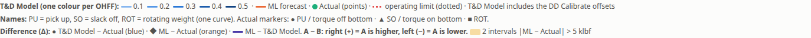

| Bagian | Artinya |
|---|---|
| **T&D Model (one colour per OHFF)** | Contoh warna biru untuk tiap OHFF: 0.1 paling muda, 0.5 paling tua. Warnanya **sama di semua grafik**, jadi warna biru tertentu selalu berarti OHFF yang sama. |
| **ML forecast** (garis oranye) | Garis perkiraan ML. |
| **Actual (points)** (titik hijau) | Pembacaan lapangan. |
| **operating limit (dotted)** (merah titik-titik) | Batas operasi. |
| **T&D Model includes the DD Calibrate offsets** | Garis biru sudah ditambah koreksi "Calibrate" dari DD, sama dengan grafik *Graph reference* di Excel DD. |
| **Names** | Singkatan: **PU** = pick up (angkat), **SO** = slack off (turunkan), **ROT** = rotating weight (berputar, satu garis saja). Bentuk titik aktual: ● PU / torque off bottom · ▲ SO / torque on bottom · ■ ROT. |
| **Difference (Δ)** | Keterangan panel ketiga (lihat bagian 6). |
| **"2 intervals \|ML − Actual\| > 5 klbf"** (kotak kuning) | Ada 2 rentang kedalaman yang selisihnya melebihi ambang yang dipilih, dan rentang itu diarsir kuning. |
| **Forecast** (ungu, muncul setelah klik Forecast) | Garis ungu tebal = forecast; pita ungu pudar = rentang kemungkinan P10–P90. |

---

## 3. Panel Hookload — tampilan seluruh sumur

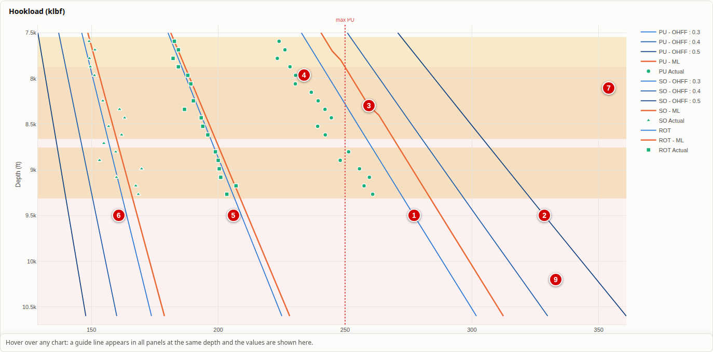

| No | Yang terlihat | Artinya |
|---|---|---|
| ❶ | **Garis biru muda** "PU - OHFF : 0.3" | Rencana WellPlan untuk **pick up** dengan *friction factor* 0.3 (gesekan lebih kecil → hookload angkat lebih kecil). |
| ❷ | **Garis biru tua** "PU - OHFF : 0.5" | Rencana pick up dengan gesekan lebih besar → hookload lebih besar. Makin tua birunya, makin besar OHFF-nya. |
| ❸ | **Garis oranye** "PU - ML" | Perkiraan ML untuk pick up di semua kedalaman. Bandingkan dengan titik hijau: makin dekat, makin tepat. |
| ❹ | **Titik hijau bulat** "PU Actual" | Pembacaan pick up sebenarnya di rig. |
| ❺ | **Kelompok tengah** (ROT, titik kotak ■) | Rotating weight: berat saat pipa diputar tanpa diangkat/diturunkan. Hanya **satu** garis biru (tidak per OHFF). |
| ❻ | **Kelompok kiri** (SO, titik segitiga ▲) | Slack off: berat saat pipa diturunkan. Selalu paling kiri (paling ringan). |
| ❼ | **Arsiran kuning** | **Interval yang ditandai** (*flag*): kedalaman yang selisih ML − aktual-nya melebihi ambang di kotak *Flag intervals* (bawaan 5 klbf). Tanda "perlu diperhatikan", bukan berarti salah. |
| ❽ | **Garis merah titik-titik** "max PU" | **Batas operasi** pick up (contoh: 250 klbf). Garis oranye/biru yang melewati garis ini berarti perkiraan menyentuh batas. |
| ❾ | **Arsiran merah sangat pudar** | Area **di bawah kedalaman tempat ML pertama kali menyentuh batas**. Peringatan visual: mulai kedalaman itu, perkiraan di atas batas. |

Urutan normal dari kiri ke kanan: **SO (kiri) → ROT (tengah) → PU (kanan)**. Bila titik hijau
melanggar urutan ini, kemungkinan data tertukar atau salah catat (diperiksa di Data Quality).

---

## 4. Pita ketidakpastian ML (P10–P90)

Centang **Uncertainty band (P10–P90)** di atas grafik (bawaan: tidak dicentang).

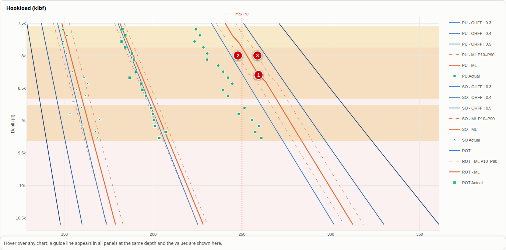

| No | Yang terlihat | Artinya |
|---|---|---|
| ❶ | **Garis oranye tebal** | Perkiraan ML (nilai paling mungkin). |
| ❷ | **Garis oranye putus-putus kiri** (P10) | Batas bawah. Kira-kira hanya 10% pembacaan aktual yang lebih kecil dari garis ini. |
| ❸ | **Garis oranye putus-putus kanan** (P90) | Batas atas. Kira-kira hanya 10% pembacaan aktual yang lebih besar dari garis ini. |

Jadi **80% pembacaan aktual diharapkan jatuh di antara dua garis putus-putus**. Makin lebar jaraknya,
makin besar ketidakpastiannya.

---

## 5. Garis penuntun dan bar pembacaan

Arahkan kursor (mouse) ke grafik mana pun.

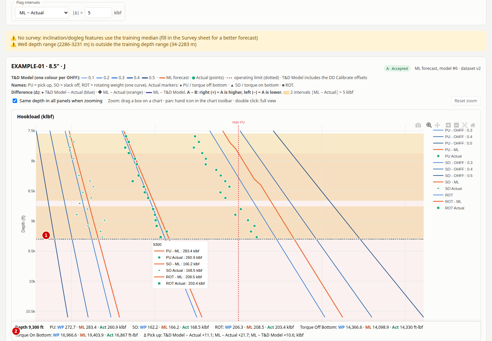

| No | Yang terlihat | Artinya |
|---|---|---|
| ❶ | **Garis hitam putus-putus mendatar** dan kotak nilai | **Garis penuntun** di kedalaman kursor, muncul di **ketiga panel sekaligus** pada kedalaman yang sama. Kotak di sebelahnya menampilkan nilai setiap garis di kedalaman itu. |
| ❷ | **Bar pembacaan** di bawah | Ringkasan di kedalaman kursor untuk semua operasi: **WP** = T&D model, **ML** = perkiraan ML, **Act** = aktual terdekat; plus selisih (Δ). Contoh "PU: WP 272.7 · ML 283.4 · Act 260.9 klbf". |

**Zoom:** tarik kotak di grafik untuk memperbesar. Klik dua kali untuk kembali. Tombol **Reset zoom**
(atau **Show whole well** saat forecast) mengembalikan seluruh kedalaman.

---

## 6. Panel Difference (Δ) — seberapa jauh melesetnya

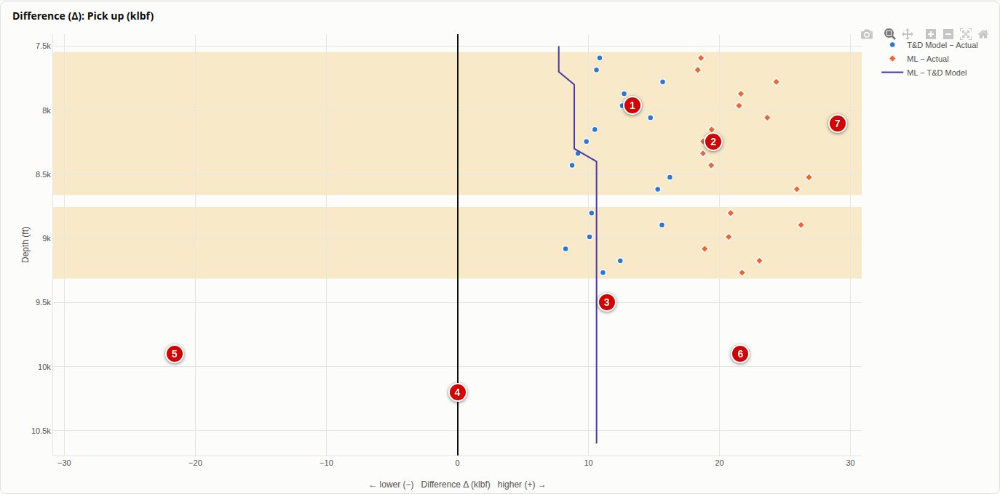

Panel ini menampilkan **selisih** untuk **satu** operasi yang dipilih di kotak *Difference (Δ) chart*
(di contoh: Pick up). Rumusnya selalu **A − B**.

| No | Yang terlihat | Artinya |
|---|---|---|
| ❶ | **Titik biru** "T&D Model − Actual" | Selisih rencana WellPlan terhadap aktual di tiap kedalaman aktual. |
| ❷ | **Belah ketupat oranye** "ML − Actual" | Selisih perkiraan ML terhadap aktual. **Makin dekat ke garis nol, makin tepat.** |
| ❸ | **Garis ungu** "ML − T&D Model" | Seberapa besar ML **mengoreksi** rencana WellPlan di setiap kedalaman. |
| ❹ | **Garis hitam tegak di 0** | Garis nol = **tepat sama** dengan aktual. |
| ❺ | **Sisi kiri** (angka negatif) | A **lebih kecil** dari B, mis. titik oranye di kiri = ML memperkirakan lebih **ringan** dari aktual. |
| ❻ | **Sisi kanan** (angka positif) | A **lebih besar** dari B, mis. titik oranye di kanan = ML memperkirakan lebih **berat** dari aktual. |
| ❼ | **Arsiran kuning** | Interval yang melewati ambang (sama dengan panel lain). |

Pilihan **Absolute / Percent**: selisih dalam satuan (klbf / ft-lbf) atau persen.

---

## 7. Forecast N ft ke depan — semua elemen ungu

Setelah mengisi panel **Forecast ahead** (contoh: Distance 300, From depth 8,600) dan klik
**Forecast**, halaman menggulir ke grafik dan **zoom otomatis** ke area forecast.

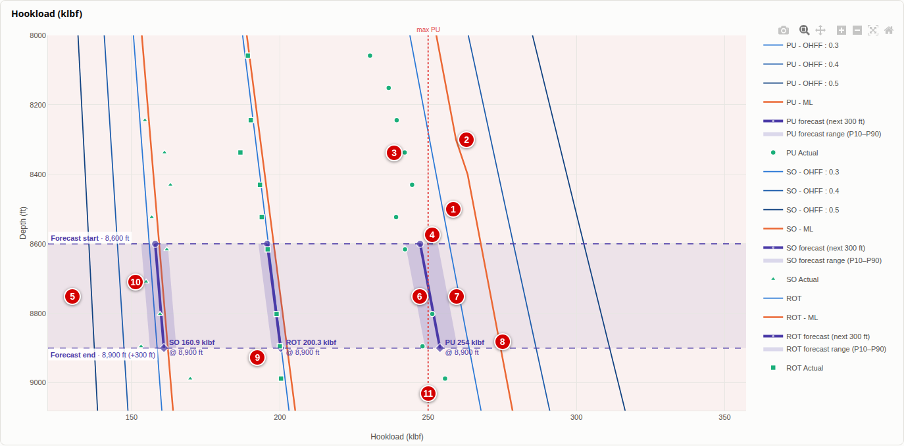

| No | Yang terlihat | Artinya |
|---|---|---|
| ❶ | **Garis biru** | Rencana WellPlan (tetap tampil sebagai pembanding). |
| ❷ | **Garis oranye** | Perkiraan ML untuk seluruh sumur **tanpa** koreksi bias. |
| ❸ | **Titik hijau di atas jendela** | Pembacaan aktual **sebelum** titik mulai. Inilah data yang dipakai untuk koreksi bias. |
| ❹ | **Garis ungu putus-putus atas** "Forecast start · 8,600 ft" | **Titik mulai forecast** = "posisi rig sekarang". Bila *From depth* kosong, ini kedalaman aktual terakhir (ditulis "last actual reading"). |
| ❺ | **Arsiran ungu sangat pudar selebar grafik** | **Jendela forecast**: rentang kedalaman yang diramal (8,600 → 8,900 ft). Hanya penanda area, **bukan** nilai. |
| ❻ | **Garis ungu tebal** | **FORECAST-NYA**: ke mana hookload diperkirakan bergerak dalam 300 ft ke depan, sudah dikoreksi bias dari pembacaan terakhir. Ini garis yang paling penting dibaca. |
| ❼ | **Pita ungu pudar miring** di sekitar garis ❻ | **Rentang kemungkinan P10–P90** forecast: pembacaan nanti kemungkinan besar (80%) jatuh di dalam pita ini. Makin lebar, makin tidak pasti. |
| ❽ | **Tulisan di ujung garis** "PU 254 klbf @ 8,900 ft" | **Nilai forecast di akhir jendela**. Contoh: pick up di 8,900 ft diperkirakan 254 klbf. Titik ◆ menandai ujungnya. |
| ❾ | **Garis ungu putus-putus bawah** "Forecast end · 8,900 ft (+300 ft)" | **Akhir forecast** (titik mulai + jarak). |
| ❿ | **Titik hijau di dalam jendela** | Pembacaan aktual sesudah titik mulai, **hanya** muncul bila Anda menguji dengan *From depth* lebih dangkal. Bandingkan dengan garis ungu: menempel = forecast tepat. Pada forecast sungguhan dari aktual terakhir, area ini kosong (belum dibor). |
| ⓫ | **Garis merah titik-titik** "max PU" | Batas operasi. Di contoh, forecast PU (254) melewati batas 250 klbf, dan hal ini juga ditulis di kalimat *Cause and effect*. |

Ringkas: **baca garis ungu tebal (❻) dan angka di ujungnya (❽)**. Pita pudar (❼) menunjukkan
seberapa jauh angka itu bisa meleset. Arsiran selebar grafik (❺) hanya menandai area forecast.

Selama forecast tampil, arsiran kuning (interval ditandai) disembunyikan agar tidak bertumpuk.
Tombol **Show whole well** kembali ke seluruh sumur; **Zoom to forecast** kembali ke area forecast;
**Clear** di panel forecast menghapus forecast.

---

## 8. Panel Torque

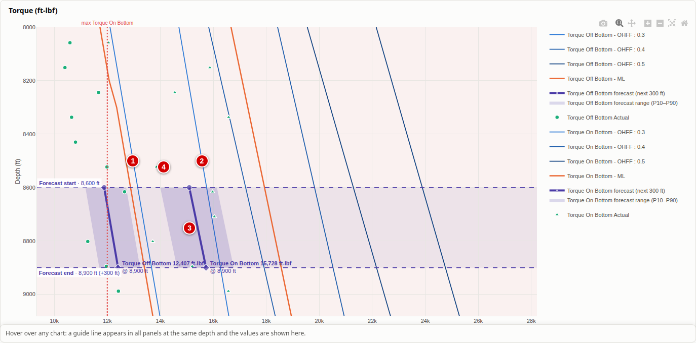

Cara baca **sama dengan Hookload**, tetapi untuk torsi (ft-lbf) dengan dua kelompok garis:

| No | Yang terlihat | Artinya |
|---|---|---|
| ❶ | Garis biru kiri "Torque Off Bottom - OHFF : 0.3" | Rencana torsi saat berputar **tanpa** menyentuh dasar (bit di atas dasar). Lebih kecil. |
| ❷ | Garis biru kanan "Torque On Bottom - OHFF : 0.3" | Rencana torsi saat **mengebor** (bit menyentuh dasar). Lebih besar. |
| ❸ | Garis ungu tebal + pita | Forecast torsi on bottom 300 ft ke depan, dengan nilai di ujungnya. |
| ❹ | Titik hijau ▲ | Pembacaan aktual torsi on bottom (● untuk off bottom). |

Garis merah titik-titik "max Torque On Bottom" = batas torsi (mis. batas top drive).

---

## 9. Tabel-tabel di bawah grafik

### 9.1 Tabel Forecast ahead

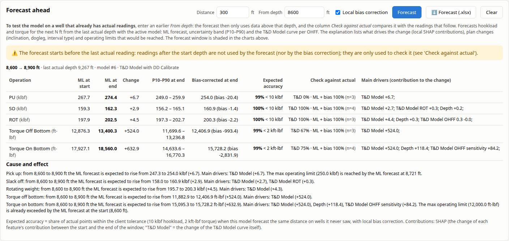

| Kolom | Artinya |
|---|---|
| **Operation** | PU, SO, ROT, Torque Off Bottom, Torque On Bottom, beserta satuannya. |
| **ML at start / ML at end** | Perkiraan ML (belum dikoreksi) di awal dan akhir jendela. |
| **Change** | Perubahan selama jendela (+ naik, − turun). |
| **P10–P90 at end** | Rentang kemungkinan di akhir jendela (sudah ikut digeser koreksi bias). |
| **Bias-corrected at end** | **Nilai forecast yang dipakai** (= angka di ujung garis ungu). "(bias −20.4)" artinya pembacaan terakhir rata-rata 20.4 klbf di bawah ML, jadi forecast digeser turun sebesar itu. |
| **Expected accuracy** | Seberapa sering model ini tepat (dalam toleransi) untuk jarak yang sama pada **banyak sumur yang tidak pernah dilihatnya**. Mis. "99% < 10 klbf". |
| **Check against actual** | Hanya muncul saat uji (*From depth* lebih dangkal): hasil forecast vs pembacaan aktual di jendela. "T&D 0% · ML + bias 100% (n=3)" artinya dari 3 pembacaan, rencana WellPlan tidak ada yang masuk toleransi, sedangkan forecast ML semuanya masuk. |
| **Main drivers** | Faktor terbesar yang membuat nilai berubah, mis. "T&D Model +6.7" = sebagian besar kenaikan mengikuti rencana WellPlan; "Inclination +3.1" = karena sudut sumur bertambah. |
| **Cause and effect** | Kalimat ringkas per operasi: naik/turun berapa, apa penyebabnya, dan apakah batas operasi terlewati (termasuk "already exceeded at the start" bila sudah di atas batas sejak awal). |

> Kalimat *Cause and effect* memakai nilai yang **sudah dikoreksi bias**, jadi angka awalnya bisa
> berbeda dengan kolom *ML at start* (yang belum dikoreksi).

### 9.2 Metrics for this well

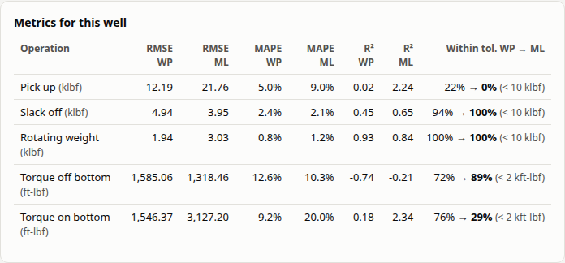

| Kolom | Artinya | Lebih baik bila |
|---|---|---|
| **RMSE WP / RMSE ML** | Rata-rata besar kesalahan (T&D model / ML) terhadap aktual, dalam satuan. | Lebih **kecil** |
| **MAPE WP / MAPE ML** | Rata-rata kesalahan dalam persen. | Lebih **kecil** |
| **R² WP / R² ML** | Seberapa baik bentuk kurva mengikuti aktual (1.00 = sempurna). | Mendekati **1** |
| **Within tol. WP → ML** | **Ukuran utama client**: persen pembacaan aktual yang selisihnya < 10 klbf (hookload) / < 2 kft-lbf (torsi). "70% → 96%" = rencana WellPlan 70%, ML 96%. | Mendekati **100%** (≥ 90% = bagus) |

### 9.3 5 depths with the largest difference

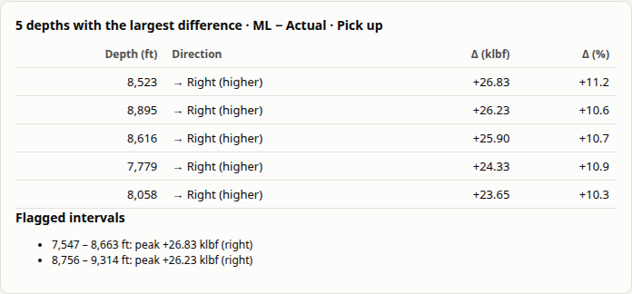

Lima kedalaman dengan selisih terbesar untuk seri yang dipilih di *Flag intervals*, beserta arahnya
(**→ Right (higher)** = lebih besar dari aktual; **← Left (lower)** = lebih kecil) dalam satuan dan persen.
Berguna untuk mencari bagian sumur yang paling sulit diperkirakan.

### 9.4 Operating limits

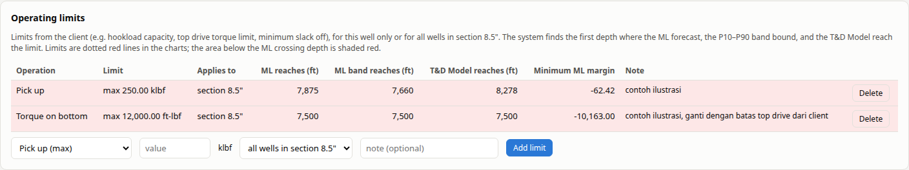

| Kolom | Artinya |
|---|---|
| **Limit** | Jenis dan nilai batas (max/min). |
| **Applies to** | Berlaku untuk sumur ini saja, atau semua sumur di section yang sama. |
| **ML reaches / ML band reaches / T&D Model reaches** | Kedalaman pertama saat ML, batas atas pita ML, atau rencana WellPlan menyentuh batas. **not reached** = tidak pernah menyentuh. |
| **Minimum ML margin** | Jarak terdekat ML ke batas di seluruh sumur (negatif = melewati batas). |

---

## 10. Output yang diunduh

| Output | Isi dan cara baca |
|---|---|
| **Export Excel** (format client "OUTPUT … Multiple T&D Road Map") | **Summary Outputs**: tabel *ACTUAL VS Machine Learning*, satu baris per kedalaman aktual; kolom "PU-MLPU" = aktual − ML (positif = aktual lebih berat dari ML); tabel metrik (R2, RMSE, MAE, MAPE); 2 gambar *Predicted vs Actual* (titik dekat garis merah putus-putus = tepat). **Tripping Load Analysis - Graph**: grafik hookload seperti panel Hookload, plus tabel angka (MODELLED, ACTUAL, TRIPPING DATA, ML PREDICTION). **Torque Analysis Off Btm / On Bottom**: sama untuk torsi (Kft.lbf). **PU/SO/ROT MW**: hasil WellPlan mentah per OHFF. |
| **PDF** | Ringkasan cetak: kualitas data, versi model, metrik, batas operasi, 6 panel grafik (warna dan arti sama dengan dashboard). |
| **⬇ Forecast (.xlsx)** | Sheet **Summary** (kalimat sebab-akibat + perkiraan akurasi + hasil cek), satu sheet per operasi (kedalaman, ML, P10, P90, nilai terkoreksi bias, T&D per OHFF, grafik), sheet **Explanation** (faktor penyebab, perubahan rencana, batas operasi). |

---

## 11. Tanya-jawab singkat

| Pertanyaan | Jawaban |
|---|---|
| Garis mana yang harus saya percaya? | Untuk kedalaman yang sudah dibor: lihat titik hijau (fakta). Untuk ke depan: **garis ungu tebal** (forecast) beserta pitanya. Garis oranye adalah perkiraan ML umum; garis biru adalah rencana awal. |
| Kenapa ada banyak garis biru? | Satu per OHFF (asumsi gesekan). Matikan **All OHFF curves** di atas grafik untuk hanya menampilkan OHFF 0.3. |
| Kenapa pita ungu lebar? | Ketidakpastian besar. Biasanya pada torsi atau sumur yang jarang di data latih; baca peringatan kuning di atas grafik. |
| Grafik terlalu ramai? | Matikan operasi yang tidak perlu (kotak centang Pick up / Slack off / …), atau zoom dengan menarik kotak. |
| Seluruh grafik berwarna merah muda? | Ada batas operasi yang sudah dilewati ML sejak kedalaman dangkal (arsiran merah pudar di bawah titik sentuh). Periksa tabel *Operating limits*. |
| Apa arti "unseen-well validation"? | Untuk sumur latih, garis oranye dibuat oleh model yang **tidak pernah melihat** sumur itu, sehingga perbandingannya jujur. |
